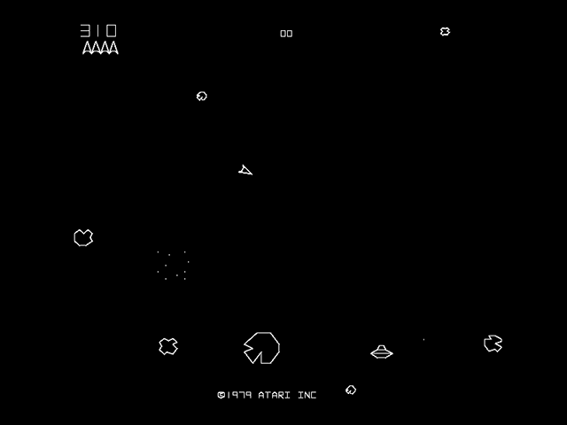
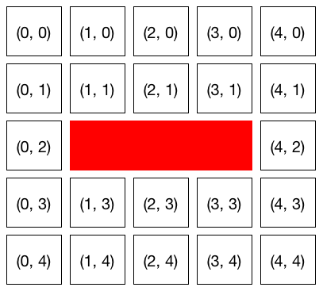
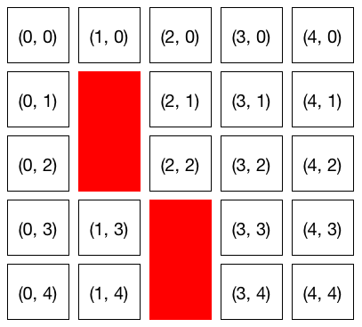
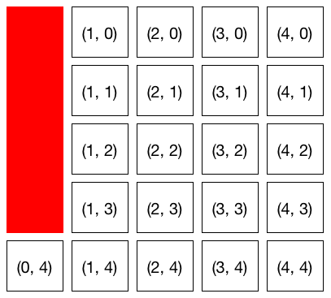
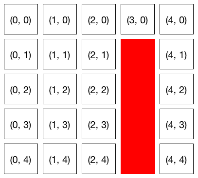
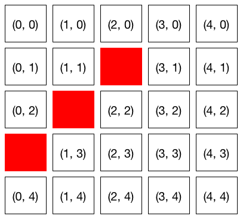

# Line

Zonder lijnen kun je bijna geen games maken.
Een van de allereerste successgames, Asteroids,
bestond vooral uit lijnen:



Je kunt een lijn tekenen met een boel puntjes,
maar de `line` functie werkt gemakkelijker.

In deze les gaan we leren 

 * hoe je lijnen tekent

Zo gaat het eruit zien:


Kun je nog geen puntjes tekenen? Ga dan 
[naar de les waarin je puntjes leert tekenen](../Point/README.md)

## Lijnen

Een lijn bestaat uit pixels.
Om een lijn te tekenen, 
moet je een beginpixel en eindpixel kiezen.
Processing tekent dan zelf de pixels ertussenin.

Om in Processing een lijn te tekenen, gebruik je de functie `line`.
De functie `line` heeft vier getallen nodig.
Deze vier getallen zijn twee coordinaten achter elkaar.
De eerste twee getallen zijn de coordinaat van het eene eind van de lijn.
De laatste twee getallen zijn de coordinaat van het ander eind van de lijn.

Hier zie je een lijn die gaat van coordinaat 
(1,2) naar (3,2):



In Processing teken je deze lijn met:

```
line(1,2,3,2);
```

De volgorde van de twee coordinaten maakt niet uit.

Lijnen kunnen ook schuin gaan.

Hier zie je een lijn die gaat van coordinaat (2,4) naar (1,1):



In Processing teken je deze lijn met:

```
line(2,4,1,1);
```

## Vragen



 * 1. Hierboven staat een lijn. Wat zijn de begin- en eindcoordinaat van die lijn?



 * 2. Hierboven staat een lijn. Wat zijn de begin- en eindcoordinaat van die lijn?



 * 3. Hierboven staat een lijn. Wat zijn de begin- en eindcoordinaat van die lijn?
 * 4. Een lijn gaat van coordinaat (0,0) naar (10,0). In welke richting gaat de lijn? Wat is het Processing commando?
 * 5. Een lijn gaat van coordinaat (0,0) naar (0,10). In welke richting gaat de lijn? Wat is het Processing commando?
 * 6. Een lijn gaat van coordinaat (0,0) naar (10,10). In welke richting gaat de lijn? Wat is het Processing commando?
 * 7. Een lijn gaat van coordinaat (30,20) naar (20,20). In welke richting gaat de lijn? Wat is het Processing commando?
 * 8. Een lijn gaat van coordinaat (10,20) 20 pixels naar rechts. Welke coordinaat heeft het eindpunt? Wat is het Processing commando?
 * 9. Een lijn gaat van coordinaat (10,30) 10 pixels naar rechtsomhoog. Welke coordinaat heeft het eindpunt? Wat is het Processing commando?
 


 * 10.Hierboven staat een tekening. Maak deze tekening na in Processing

## Oplossing

 * 1. (0,0) en (0,3)
 * 2. (3,1) en (3,4)
 * 3. (2,1) en (0,3)
 * 4. Van links naar rechts/horizontaal. `line(0,0,10,0)`
 * 5. Van onder naar boven/verticaal. `line(0,0,0,10)`
 * 6. Schuin/diagonaal. `line(0,0,0,10)`
 * 7. Van rechts naar links/horizontaal. `line(30,20,20,20)`
 * 8. (30,20). `line(10,20,30,20)`
 * 9. (20,20). `line(10,30,20,20)`
 * 10. Zie hieronder:

```
void setup()
{
  size(300,300);  
}

void draw() 
{
  //         
  //    a    
  //   / \   
  //  e---b  
  //  |\ /|  
  //  | X |  
  //  |/ \|  
  //  d---c  
  //
  // a: (150, 50)
  // b: (200,100)
  // c: (200,200)
  // d: (100,200)
  // e: (100,100)

  //Van a naar b
  line(150,50,200,100);
  //Van b naar c
  line(200,100,200,200);
  //Van c naar d
  line(200,200,100,200);
  //Van d naar e
  line(100,200,100,100);
  //Van e naar a
  line(100,100,150,50);
  //Van b naar d
  line(200,100,100,200);
  //Van b naar e
  line(200,100,100,100);
  //Van c naar e
  line(200,200,100,100);
}
```