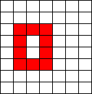
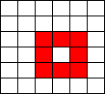
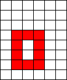

# Rect

Vierkanten worden veel gebruikt in games.


Je kunt een vierkant tekenen met vier lijnen,
maar de `rect` functie werkt gemakkelijker.

In deze les gaan we leren 

 * hoe je lijnen tekent

Zo gaat het eruit zien:


Kun je nog geen lijnen tekenen? Ga dan 
[naar de les waarin je lijnen leert tekenen](../Line/README.md)

## Rechthoeken

Een rechthoek bestaat uit vier lijnen.
Om een rechthoek te tekenen, 
moet je een coordinaat, breedte en hoogte geven.

Om in Processing een rechthoek te tekenen, gebruik je de functie `rect`.
De functie `rect` heeft vier getallen nodig.
De eerste twee getallen zijn de coordinaat van de linkerbovenhoek van de rechthoek.
Het derde getal is de breedte van de rechthoek.
Het vierde getal is de hoogte van de rechthoek.

Hier zie je een rechthoek met coordinaat (1,2), een breedte van drie pixels en hoogte van vier pixels:



In Processing teken je deze rechthoek met:

```
rect(1,2,3,4);
```

Hier is nog een rechthoek:


De linkerbovenhoek heeft coordinaat (2,1), hij is vier pixels breed en drie pixels hoog.

## Vragen



 * 1. Hierboven staat een rechthoek. Wat is de coordinaat van de linkerbovenhoek? Hoe breed is de rechthoek? Hoe hoog is de rechthoek?



 * 2. Hierboven staat een rechthoek. Wat is de coordinaat van de linkerbovenhoek? Hoe breed is de rechthoek? Hoe hoog is de rechthoek?


 * 3. Hierboven staat een rechthoek. Wat is de coordinaat van de linkerbovenhoek? Hoe breed is de rechthoek? Hoe hoog is de rechthoek?
 * 4. Een rechthoek heeft als coordinaat (0,0), is twee pixels breed en drie pixels hoog. Wat is het Processing commando?
 * 5. Een rechthoek heeft als coordinaat (1,2), is drie pixels breed en vier pixels hoog. Wat is het Processing commando?
 * 6. Een rechthoek heeft als coordinaat (10,20), is dertig pixels breed en veertig pixels hoog. Wat is het Processing commando?
 


 * 10.Hierboven staat een tekening. Maak deze tekening na in Processing

## Oplossing

 * 1. (0,0) en (0,3)
 * 2. (3,1) en (3,4)
 * 3. (2,1) en (0,3)
 * 4. Van links naar rechts/horizontaal. `line(0,0,10,0)`
 * 5. Van onder naar boven/verticaal. `line(0,0,0,10)`
 * 6. Schuin/diagonaal. `line(0,0,0,10)`
 * 7. Van rechts naar links/horizontaal. `line(30,20,20,20)`
 * 8. (30,20). `line(10,20,30,20)`
 * 9. (20,20). `line(10,30,20,20)`
 * 10. Zie hieronder:

```
void setup()
{
  size(300,300);  
}

void draw() 
{
  //         
  //    a    
  //   / \   
  //  e---b  
  //  |\ /|  
  //  | X |  
  //  |/ \|  
  //  d---c  
  //
  // a: (150, 50)
  // b: (200,100)
  // c: (200,200)
  // d: (100,200)
  // e: (100,100)

  //Van a naar b
  line(150,50,200,100);
  //Van b naar c
  line(200,100,200,200);
  //Van c naar d
  line(200,200,100,200);
  //Van d naar e
  line(100,200,100,100);
  //Van e naar a
  line(100,100,150,50);
  //Van b naar d
  line(200,100,100,200);
  //Van b naar e
  line(200,100,100,100);
  //Van c naar e
  line(200,200,100,100);
}
```